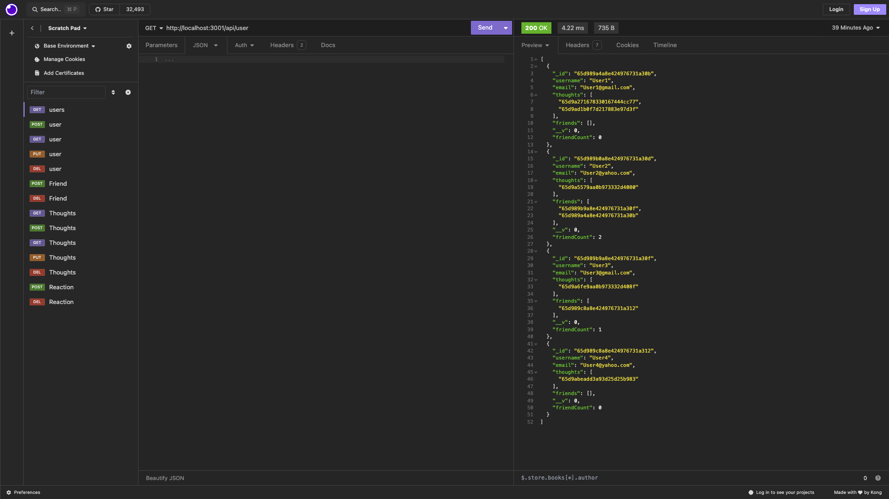
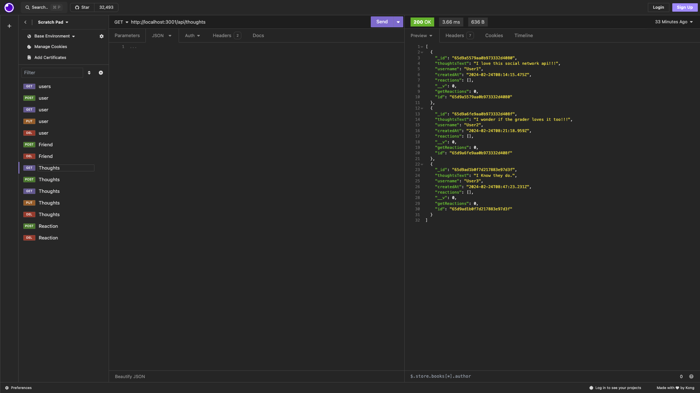

# Social-Network-Api

## License
  

  This project is licensed under the MIT license.
  
<a href= "https://choosealicense.com/licenses/mit/">link to MIT license</a>

## Description
An API for a social network application where users can share their thoughts, react to friends thoughts and create a friends list.

## Table of Contents
- [License](#license)
- [Installation](#installation)
- [Usage](#usage)
- [Contributing](#contributing)
- [Tests](#tests)
- [Questions](#questions)

## Installation
Express.js, mongoDB, mongoose ODM

## Usage
Cd into Social-Network-Api and run node index.js in terminal to start server. Then open up insomnia to test all routes there.

## Contributing
Eric Reyna

## Tests
Video Recording will be linked with readme for any instructions needed with application.

## Questions
For additional questions, you can reach me through:
- GitHub: [Ereyna21](https://github.com/Ereyna21)
- Email: Ereyna21075@gmail.com

Recording Link:
https://drive.google.com/file/d/1QnfcG5cH4IdwzYQ5cjCr4fZmGWW0_t5T/view

Repository Link:
https://github.com/Ereyna21/Social-Network-API

